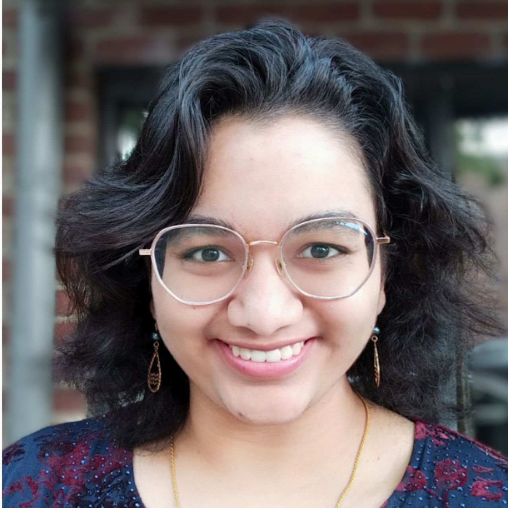

	

		

			

		

			<h1 id="intro-title">Hi, I'm Mansi Phute</h1>
			
CS PhD at Georgia Tech

			

				
					
						
					
				
			

		

	

	<!-- 
 -->
	

		<a href="{{ site.url }}/cv">
<i class="fa fa-portrait icon icon-right-space"></i>CV
</a>
		<a href="{{ site.url }}/projects">
<i class="fa fa-shapes icon icon-right-space"></i>Projects
</a>
		<a href="{{ site.url }}/everything-else">
<i class="fa fa-list-ul icon icon-right-space"></i>Everything Else
</a>
	

	

		My research focuses on the <b>security</b> and <b>explainability</b> of multimodal foundation models. I work on developing explanations for ML systems, analyzing them to identify vulnerabilities, and finding solutions to mitigate these issues.
		My work spans a wide range of application areas, including multi-object robust tracking in computer vision, developing defenses against attacks on large language models, and understanding large language models and the insights they can give us into human interactions.
	

	

	

		I am currently a PhD student at Georgia Tech with <a href="http://www.cc.gatech.edu/~dchau/">Polo Chau</a> as a part of the <a href="http://poloclub.gatech.edu">Polo Club of Data Science</a>.
		 
	

	

	

		I have collaborated with designers, developers, and scientists at  Intel Labs,  Nanyang Technological University, and  Dassault Systems.
	

<h2 class="feature-title l-middle"> Featured Publications </h2>

	
	
		
			
		
	

<!-- <h2 class="feature-title l-middle">
	<a href="{{ site.url }}/everything-else" style="color: #303030">Everything Else</a>
</h2>

	<a href="{{ site.url }}/projects">
All Projects
</a>
	<a href="{{ site.url }}/blog">
Blogs
</a>
    <a href="{{ site.url }}/tools">
Tools
</a>

 -->

[gt]: http://www.gatech.edu "Georgia Tech"
[cse]: http://cse.gatech.edu "Georgia Tech Computational Science and Engineering"
[coc]: http://www.cc.gatech.edu "Georgia Tech College of Computing"

[cv]: {{ site.url }}/cv
[polo]: http://www.cc.gatech.edu/~dchau/ "Polo Chau"
[poloclub]: http://poloclub.gatech.edu "Polo Club of Data Science"

<!--  <a href="http://poloclub.gatech.edu">Polo Club of Data Science</a> -->

<!-- I have strong interests in building reliable algorithms and toolkits that understand, fortify and democratize AI security with an eye towards scalability and practicality in real-world settings.  -->

<!-- , with an emphasis on enhancing deep learning algorithm safety and explainability. I achieve this through methods of architecture modification, multi-task learning, and visualizing model behavior under adversarial attacks. My work also spans application domains such as multimodal systems, object detection, object tracking, table representation learning, and structural health monitoring. -->

<!-- In general, I have strong interests in creating scalable, efficient, and robust multimodal models.
scalable and practical AI security algorithms and toolkits. -->
